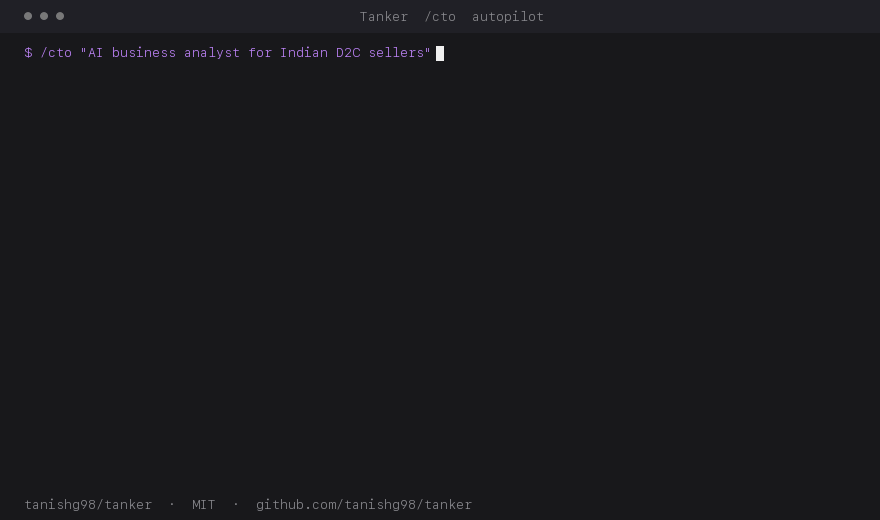

<div align="center">

# tanker

**A Claude Code framework that ships deployed products from a one-line brief.**

[](https://opensource.org/licenses/MIT)
[](https://tanker.dev)
[](https://docs.claude.com/claude-code)

[Docs](https://tanker.dev) · [Examples](./examples/) · [Compare](./docs/comparisons/metagpt.md) · [Discord](https://discord.gg/tanker)

</div>

---

<div align="center">



<sub>Synthesized animation of a real `/cto` run. Live screen-cast in `examples/saas-mvp/`.</sub>

</div>

```bash
/cto "AI business analyst for Indian D2C sellers — connects 6 SaaS tools, chat with your data"
```

…~30 minutes of attention later, you have:

- ✅ Live production URL
- ✅ Repo with branch protection, CI, versioned migrations
- ✅ Provisioned Vercel + Railway + Supabase + GitHub
- ✅ Sentry + analytics + uptime wired
- ✅ Full audit trail in `outputs/<slug>/messages.jsonl`

---

## Install

```bash
bash <(curl -fsSL https://raw.githubusercontent.com/tanishg98/tanker/main/install.sh)
```

That's it. The installer copies `.claude/` into the current directory, sets up the vault, and (optionally) builds the brain-index over your Obsidian vault.

Then add credentials and run:

```bash
/vault-add github vercel supabase anthropic
/cto "todo app with email auth and a kanban board"
```

→ [Detailed install guide](./docs/getting-started/install.md)

---

## What's different

- **Two human gates pre-qualified by review agents.** Most autopilots either go fully autonomous (and ship slop) or stop everywhere (and waste your time). Tanker stops twice — at PRD, at MVP — but only after a review agent has pre-qualified the work. You see only what's worth seeing.
- **Real infrastructure provisioning.** GitHub repo, Supabase project, Vercel project, Railway service — created via official APIs from a vault at `~/.claude/vault/credentials.json` (0600).
- **Resumable across sessions.** State checkpointed every phase to `state.json`. `messages.jsonl` is the typed audit trail. `/cto --resume <slug>` picks up exactly where you left off.
- **Local semantic retrieval.** Tanker indexes your Obsidian vault + curated GitHub references into local ChromaDB. `/cto` Phase 1 retrieves from your accumulated knowledge — not generic GitHub search.
- **Opinionated quality rails.** Builder-ethos rules are always on: Boil the Lake, Search Before Building, No AI Slop (with an explicit ban list), Safety Before Speed, Skill Chaining.
- **Cost ceiling.** `--max-cost-usd` (default $10). Tanker tracks spend in `messages.jsonl`, warns at 70%, halts at 100%.

→ [Architecture overview](./docs/architecture/overview.md)

---

## The pipeline

```
intake → context (parallel: brain, refs) → reference (github-scout)
  → /grill → /benchmark? → /prd → prd-reviewer → 🛑 GATE 1 (human PRD review)
  → /architect → /createplan → /advisor (cross-model peer review)
  → PROVISION (parallel: gh, supabase, vercel, railway)
  → BUILD (parallel: frontend, backend, data, content engineers)
  → /pre-merge + /autoresearch-review per PR (bounded retry loop, max 2)
  → mvp-reviewer → 🛑 GATE 2 (human MVP review)
  → /deploy → /monitor → final report
```

Two human gates. State checkpointed every phase. Idempotent provisioners. Healthcheck-gated rollback.

→ [How `/cto` works](./docs/getting-started/first-cto.md)

---

## Skills

34 skills across product, design, planning, building, quality, and memory.

| Phase | Skill | What it does |
|---|---|---|
| Think | `/grill` | YC-style forcing questions before code |
| Research | `/ui-hunt` | Find best-in-class UI references |
| Compare | `/benchmark` | Feature matrix vs competitors |
| Spec | `/prd` | Exhaustive PRD with HTML wireframes |
| Design | `/architect` | System design — components, APIs, data, decisions |
| Plan | `/createplan` | Risk-first plan with verify gates |
| Build | `/execute` | Step-by-step implementation |
| Analyze | `/analyst` | Python sandbox + ReAct loop on data |
| Ship | `/ship` | Sync, test, push, structured PR |
| Deploy | `/deploy` | Vercel / Railway / Fly / Docker |
| Watch | `/monitor` | Sentry / Plausible / Better Stack |
| Improve | `/retro` | Weekly retrospective writes back to brain |

→ [Full skill index](./docs/skills/index.md)

---

## Agents

9 agents — read-only review specialists, research agents, and scoped-write provisioners.

| Agent | Purpose |
|---|---|
| `explore` | Map codebase before planning |
| `pre-merge` | Combined quality + bug gate |
| `prd-reviewer` | Pre-qualify PRD before human gate |
| `mvp-reviewer` | Pre-qualify MVP before human gate |
| `github-scout` | Tier 0 curated refs, Tier 1 wider search |
| `site-eval` | 9-dimension static site audit |
| `gh-provisioner` | Repo + branch protection + secrets |
| `supabase-provisioner` | Project + RLS + Management API |
| `vercel-provisioner` | Project + env vars + preview deploys |
| `railway-provisioner` | Service + healthcheck + Postgres |

→ [Agent details](./docs/agents/index.md)

---

## Always-on rules

- **`builder-ethos`** — six principles loaded every session.
- **`code-standards`** — type discipline, comment-the-why, pattern consistency.
- **`static-site-standards`** — single-file first, no frameworks, IntersectionObserver, eval gate.

→ [Rules](./docs/rules/builder-ethos.md)

---

## Examples

Five worked examples:

- [SaaS MVP](./examples/saas-mvp/) — `/cto` end-to-end
- [Static site](./examples/static-site/) — `/static-site-replicator` + `/design-shotgun`
- [Browser extension](./examples/browser-extension/) — Chrome MV3
- [Bug fix](./examples/bug-fix/) — `/explore` → `/debug` → `/test-gen` → `/ship`
- [Data analysis](./examples/data-analysis/) — `/analyst` ReAct loop

---

## Compare

- [Tanker vs MetaGPT](./docs/comparisons/metagpt.md) — most-asked comparison
- [Tanker vs AutoGen](./docs/comparisons/autogen.md)
- [Tanker vs CrewAI](./docs/comparisons/crewai.md)
- [Tanker vs Aider](./docs/comparisons/aider.md)
- [Tanker vs gstack](./docs/comparisons/gstack.md)

---

## Project structure

```
.claude/
├── agents/      — 9 specialist agents
├── rules/       — 3 always-on operating principles
├── schemas/     — JSON schemas for validated artifacts
└── skills/      — 34 slash commands

docs/            — mkdocs site (deployed to tanker.dev)
examples/        — five worked examples
outputs/         — runs go here (one folder per slug)

install.sh       — one-line installer
mkdocs.yml       — docs config
README.md        — this file
```

---

## Contribute

PRs welcome. Bar:

- New skills: SOP triplet (Constraints / Reference / Output Format), JSON sidecar schema, worked example.
- New agents: structured JSON output validated against a schema in `.claude/schemas/`.
- New rules: argued in PR description with concrete examples of the failure mode it prevents.

Run `mkdocs build --strict` before opening a docs PR.

---

## License

MIT. Built by [Tanish Girotra](https://github.com/tanishg98).

If you're shipping with Tanker, [post in the show-your-build channel](https://discord.gg/tanker) — it's the fastest way to feedback that improves the framework.
